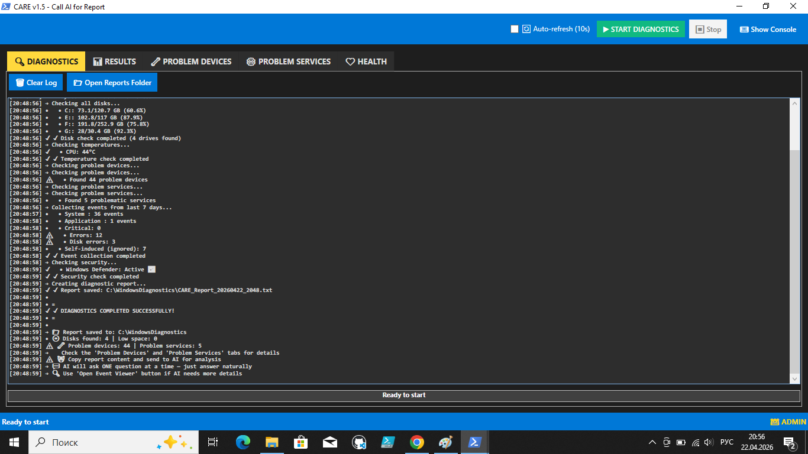
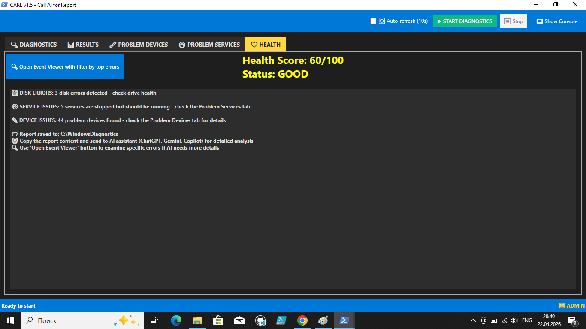

# CARE-v1.5 — Call AI for Report

**Мост между диагностикой Windows и AI-ассистентами**

---

## 🎯 Что такое CARE-v1.5?

**CARE-v1.5** (Call AI for Report) — это инструмент диагностики Windows, который собирает информацию о системе и формирует структурированный отчёт, **оптимизированный для AI-ассистентов** (ChatGPT, Gemini, Claude, DeepSeek и другие).

### Главные принципы

| Принцип | Как реализован |
|---------|----------------|
| **Не пугает пользователя** | Понятные формулировки, оценка GOOD/FAIR вместо критических ошибок |
| **Экономит токены AI** | Краткий контекст (QUICK CONTEXT), а не сырые логи |
| **Соблюдает приватность** | Никаких имён пользователя, путей к файлам, серийных номеров |
| **Включает диалог** | AI задаёт **один вопрос за раз** и ведёт пользователя по шагам |

---

## ✨ Возможности

| Функция | Описание |
|---------|----------|
| **📊 Системная информация** | Процессор, оперативная память, версия Windows |
| **💾 Все диски** | C:, D:, E:, ... (исключены ESP и Recovery разделы <1 ГБ) |
| **🌡️ Температура** | Температура процессора (если доступна) |
| **📋 Журналы событий** | Critical, Errors, Disk Errors, WMI Errors (за 7 дней) |
| **🔧 Проблемные устройства** | Список устройств с ошибками драйверов или фантомные USB |
| **⚙️ Проблемные службы** | Остановленные службы, которые должны работать |
| **🛡️ Безопасность** | Статус Защитника Windows |
| **❤️ Оценка здоровья** | Шкала 0–100 (CRITICAL / FAIR / GOOD / EXCELLENT) |
| **🤖 Отчёт для AI** | Структурированный, токен-эффективный, с инструкцией для диалога |
| **🔍 Кнопка Event Viewer** | Открывает журнал событий с подсказкой по фильтрации |

---

## 📸 Скриншоты

| Главное окно | Пример отчёта |
|--------------|---------------|
|  |  |

---

> **⚠️ Важное замечание по безопасности**
> 
> Скрипт **CARE-v1.5** предназначен для использования на **личных (частных) компьютерах**.
> 
> На **корпоративных (рабочих) машинах** перед использованием необходимо:
> - Согласовать запуск с вашим IT-отделом
> - Соблюдать правила информационной безопасности организации
> - Убедиться, что сбор диагностических данных не нарушает внутренние политики компании
>   
> *Автор не несёт ответственности за использование скрипта в корпоративной среде без соответствующих разрешений.*

---

## 🚀 Быстрый старт

### Требования
- Windows 10 / Windows 11 (64-bit)
- PowerShell 5.1 или выше
- Права администратора

### Установка

1. **Скачай** файл `CARE-v1.5.ps1` (см. раздел [Releases](../../releases) или скачай вручную)
2. **Сохрани** в любую папку (например, `C:\Tools\CARE\`)
3. **Нажми правой кнопкой** на файл → **Run with PowerShell**

### Или через командную строку (от администратора):
  powershell
cd "C:\Tools\CARE\CARE-v1.5.ps1"

---

### 🙏 Благодарность

Этот инструмент никогда не появился бы на свет без **DeepSeek** — команды разработчиков, создавших AI,
который не просто отвечает на вопросы, а **думает вместе с вами**.

Спасибо за ваше волшебство. Вы превратили код в диалог, а диагностику — в искусство.

— *С уважением и восхищением, автор CARE-v1.5*

---

## ☕ Поддержать проект

CARE создавался с душой и бесплатен для всех.  
Если инструмент помог вам сэкономить время или избавил от головной боли — вы можете поддержать автора чашечкой кофе ☕

**СБП:** Переведите любую сумму на номер +7 928 703 49 52

*Спонсорство не даёт привилегий, не ускоряет разработку и не делает код лучше. Но оно даёт мне понять, что моя работа нужна людям. А это дорогого стоит.* 🙏

---
